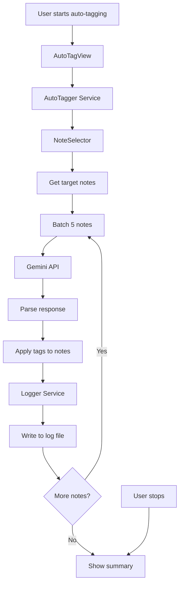

# Design Document

## Overview

本設計書は、Obsidian vaultのノートに対してGemini AIを使用して自動的にタグを付与する機能の技術設計を定義します。既存のプラグインコードベース（Gemini API統合、Svelteビュー、設定管理）を活用し、継続的なバッチ処理によるタグ付与機能を実装します。

### Key Features
- 指定ディレクトリ配下のマークダウンファイルを対象にした自動タグ付与
- 一度に5つのノートをバッチ処理
- カスタマイズ可能なsystem instruction
- 処理の継続的実行と中断機能
- ログファイルへの詳細記録とサマリー表示

## Architecture

### Component Structure

```
src/
├── commands/
│   └── autoTagging.ts          # 自動タグ付けコマンドのエントリーポイント
├── services/
│   ├── autoTagger.ts           # 自動タグ付けのコアロジック
│   ├── noteSelector.ts         # 対象ノート選出ロジック
│   └── logger.ts               # ログファイル管理
├── api/
│   └── gemini.ts               # 既存: Gemini API呼び出し（拡張）
├── view/
│   ├── AutoTagView.svelte      # 自動タグ付けUI
│   └── autoTagView.ts          # Obsidian View wrapper
├── settings.ts                 # 既存: 設定管理（拡張）
└── main.ts                     # 既存: プラグインエントリーポイント（拡張）
```

### Data Flow



## Components and Interfaces

### 1. Settings Extension

既存の`PersonalContextSettings`インターフェースに新しい設定セクションを追加します。

```typescript
export interface AutoTaggerSettings {
    targetDirectory: string;              // 対象ディレクトリパス
    excludeNoteTag: string;               // ノート除外タグ
    excludeSuggestionTags: string[];      // 提案から除外するタグリスト
    systemInstruction: string;            // カスタムsystem instruction
    batchSize: number;                    // バッチサイズ（デフォルト5）
    logFilePath: string;                  // ログファイルパス
    maxLogFileSize: number;               // ログファイル最大サイズ（MB）
}

export interface PersonalContextSettings {
    common: CommonSettings;
    aiContext: AIContextSettings;
    basesSuggester: BasesSuggesterSettings;
    autoTagger: AutoTaggerSettings;       // 新規追加
}
```

### 2. NoteSelector Service

対象ノートを選出するサービス。

```typescript
export interface NoteFilter {
    targetDirectory: string;
    excludeTag: string;
}

export class NoteSelector {
    constructor(private app: App);

    /**
     * フィルタ条件に基づいて対象ノートを取得
     */
    async getTargetNotes(filter: NoteFilter): Promise<TFile[]>;

    /**
     * ディレクトリ配下の全マークダウンファイルを取得
     */
    private async getNotesInDirectory(dirPath: string): Promise<TFile[]>;

    /**
     * 指定タグを持つかチェック
     */
    private hasTag(file: TFile, tag: string): boolean;
}
```

### 3. AutoTagger Service

自動タグ付けのコアロジックを管理するサービス。

```typescript
export interface AutoTaggerState {
    isRunning: boolean;
    currentBatch: number;
    totalNotes: number;
    processedNotes: number;
    successCount: number;
    errorCount: number;
    shouldStop: boolean;
}

export interface BatchResult {
    path: string;
    suggestedTags: string[];
    success: boolean;
    error?: string;
}

export class AutoTagger {
    private state: AutoTaggerState;
    private logger: LoggerService;

    constructor(
        private app: App,
        private settings: AutoTaggerSettings,
        private geminiSettings: CommonSettings
    );

    /**
     * 自動タグ付け処理を開始
     */
    async start(
        onProgress: (state: AutoTaggerState) => void,
        onBatchComplete: (results: BatchResult[]) => void
    ): Promise<void>;

    /**
     * 処理を停止
     */
    stop(): void;

    /**
     * 1バッチ（5ノート）を処理
     */
    private async processBatch(notes: TFile[]): Promise<BatchResult[]>;

    /**
     * タグをノートに適用
     */
    private async applyTagsToNote(file: TFile, tags: string[]): Promise<void>;

    /**
     * 最終サマリーを取得
     */
    getSummary(): AutoTaggerSummary;
}
```

### 4. Logger Service

ログファイルへの記録を管理するサービス。

```typescript
export interface LogEntry {
    timestamp: string;
    notePath: string;
    appliedTags: string[];
    success: boolean;
    error?: string;
}

export interface AutoTaggerSummary {
    totalNotes: number;
    successCount: number;
    errorCount: number;
    totalTagsApplied: number;
    startTime: string;
    endTime: string;
}

export class LoggerService {
    constructor(
        private app: App,
        private logFilePath: string,
        private maxFileSize: number
    );

    /**
     * ログエントリを記録
     */
    async log(entry: LogEntry): Promise<void>;

    /**
     * サマリーをログに記録
     */
    async logSummary(summary: AutoTaggerSummary): Promise<void>;

    /**
     * ログファイルのローテーション
     */
    private async rotateLogFile(): Promise<void>;

    /**
     * ログファイルのサイズをチェック
     */
    private async checkFileSize(): Promise<number>;
}
```

### 5. Gemini API Extension

既存の`gemini.ts`に新しいプロンプト構築関数を追加します。

```typescript
export interface AutoTagBatchNote {
    path: string;
    title: string;
    content: string;
    existingTags: string[];
}

/**
 * 自動タグ付けバッチ処理用のプロンプトを構築
 */
export function buildAutoTaggingPrompt(
    notes: AutoTagBatchNote[],
    availableTags: string[],
    systemInstruction: string
): string;
```

### 6. AutoTagView (Svelte Component)

自動タグ付けUIのSvelteコンポーネント。

```typescript
// AutoTagView.svelte
<script lang="ts">
    export let plugin: MyPlugin;

    // State
    let isRunning = false;
    let state: AutoTaggerState;
    let logs: string[] = [];
    let summary: AutoTaggerSummary | null = null;

    // Settings (editable)
    let targetDirectory: string;
    let excludeNoteTag: string;
    let excludeSuggestionTags: string;
    let systemInstruction: string;

    // Methods
    async function startAutoTagging();
    function stopAutoTagging();
    function updateProgress(newState: AutoTaggerState);
    function addLog(message: string);
</script>
```

## Data Models

### Configuration Data

```typescript
// デフォルト設定
export const DEFAULT_AUTO_TAGGER_SETTINGS: AutoTaggerSettings = {
    targetDirectory: "",
    excludeNoteTag: "",
    excludeSuggestionTags: [],
    systemInstruction: "あなたは知識管理の専門家です。ノートの内容を分析し、最も適切なタグを提案してください。",
    batchSize: 5,
    logFilePath: ".obsidian/plugins/auto-tagger/logs/auto-tag.log",
    maxLogFileSize: 10, // MB
};
```

### API Request/Response

```typescript
// Gemini APIへのリクエスト形式
interface AutoTaggingRequest {
    systemInstruction: string;
    notes: AutoTagBatchNote[];
    availableTags: string[];
}

// Gemini APIからのレスポンス形式
interface AutoTaggingResponse {
    suggestions: {
        path: string;
        suggestedTags: string[];
    }[];
}
```

### Log File Format

ログファイルは以下の形式で記録されます：

```
=== Auto-Tagging Session Started ===
Timestamp: 2025-10-11T10:30:00.000Z
Target Directory: notes/
Exclude Note Tag: processed
Exclude Suggestion Tags: meta, system

[2025-10-11T10:30:05.123Z] SUCCESS: notes/example1.md
  Applied Tags: productivity, project-management, ai

[2025-10-11T10:30:08.456Z] SUCCESS: notes/example2.md
  Applied Tags: learning, education

[2025-10-11T10:30:10.789Z] ERROR: notes/example3.md
  Error: API request failed

=== Session Summary ===
Total Notes: 15
Success: 13
Errors: 2
Total Tags Applied: 42
Duration: 2m 30s
```

## Error Handling

### Error Categories

1. **Configuration Errors**
   - 対象ディレクトリが存在しない
   - API keyが設定されていない
   - 対象ノートが見つからない

2. **API Errors**
   - Gemini APIリクエスト失敗
   - レスポンスのパースエラー
   - レート制限エラー

3. **File Operation Errors**
   - ノートの読み込み失敗
   - frontmatterの更新失敗
   - ログファイルの書き込み失敗

### Error Handling Strategy

```typescript
// エラーハンドリングの基本方針
try {
    // バッチ処理
    const results = await processBatch(notes);
} catch (error) {
    // エラーをログに記録
    await logger.log({
        timestamp: new Date().toISOString(),
        notePath: currentNote.path,
        appliedTags: [],
        success: false,
        error: error.message
    });

    // UIに通知
    onProgress({
        ...state,
        errorCount: state.errorCount + 1
    });

    // 次のバッチに進む（処理は継続）
    continue;
}
```

## Testing Strategy

### Unit Tests

1. **NoteSelector**
   - ディレクトリフィルタリングのテスト
   - タグ除外ロジックのテスト
   - エッジケース（空ディレクトリ、存在しないパス）

2. **AutoTagger**
   - バッチ処理ロジックのテスト
   - 状態管理のテスト
   - 停止機能のテスト

3. **LoggerService**
   - ログ書き込みのテスト
   - ファイルローテーションのテスト
   - サマリー生成のテスト

### Integration Tests

1. **End-to-End Flow**
   - 設定 → ノート選出 → API呼び出し → タグ適用 → ログ記録
   - 複数バッチの連続処理
   - 中断と再開

2. **Error Scenarios**
   - API障害時の挙動
   - ファイル操作失敗時の挙動
   - 不正な設定値の処理

### Manual Testing

1. **UI Testing**
   - ビューの表示と操作
   - 進捗表示の更新
   - ログ表示のリアルタイム更新

2. **Performance Testing**
   - 大量ノート（100+）の処理
   - ログファイルのサイズ増加
   - メモリ使用量

## Implementation Notes

### Existing Code Reuse

以下の既存コンポーネントを再利用します：

1. **Gemini API Integration** (`src/api/gemini.ts`)
   - `callGeminiApi()` 関数
   - エラーハンドリングパターン

2. **Settings Management** (`src/settings.ts`)
   - 設定タブの構造
   - 設定の保存/読み込み

3. **Obsidian Utilities** (`src/utils/obsidian.ts`)
   - `getAllVaultTags()` - vault内の全タグ取得
   - `processFrontmatter()` - frontmatter操作

4. **View System** (`src/view/`)
   - Svelteビューの登録パターン
   - リボンアイコンとコマンドの追加

### Key Design Decisions

1. **バッチサイズを5に固定**
   - API呼び出しの効率化
   - レート制限への配慮
   - エラー発生時の影響範囲を限定

2. **ログファイルへの記録**
   - 処理結果の永続化
   - トラブルシューティングの容易化
   - 監査証跡の提供

3. **継続的処理と中断機能**
   - ユーザーの制御を維持
   - 長時間処理への対応
   - 現在のバッチ完了後に停止

4. **既存タグの保持**
   - データ損失の防止
   - 重複タグの自動除外
   - frontmatterの安全な更新

### Performance Considerations

1. **API呼び出しの最適化**
   - バッチ処理による呼び出し回数削減
   - 適切なタイムアウト設定

2. **ファイル操作の効率化**
   - キャッシュされた読み込み（`cachedRead`）の使用
   - frontmatter更新の最小化

3. **メモリ管理**
   - 大量ノートの段階的処理
   - ログバッファのフラッシュ

### Security Considerations

1. **API Key管理**
   - 既存の設定システムを使用
   - パスワードフィールドでの入力

2. **ファイルアクセス**
   - 指定ディレクトリ配下のみアクセス
   - vault外へのアクセス防止

3. **ログファイル**
   - `.obsidian`ディレクトリ内に保存
   - 機密情報の記録を避ける
