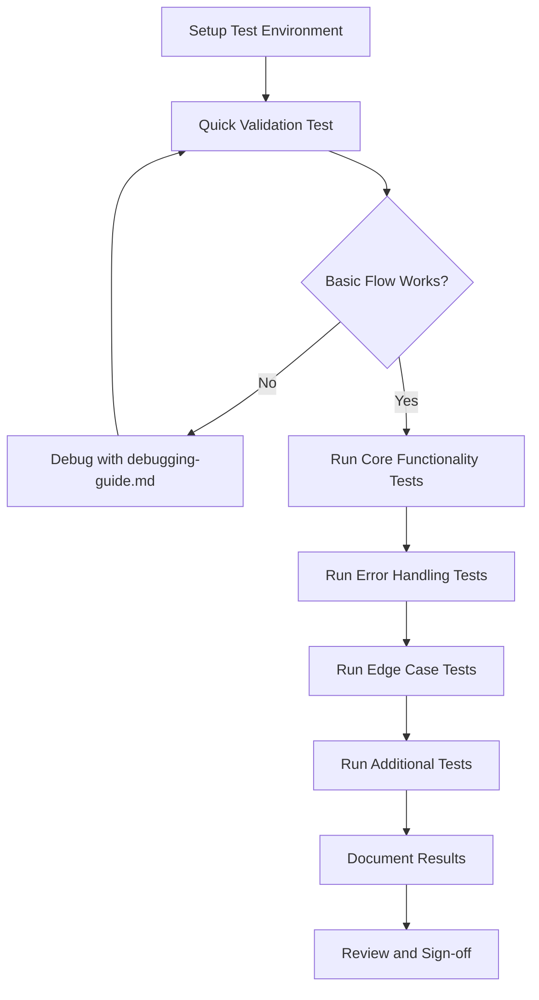

# Integration Testing Summary

## Overview

This document provides a comprehensive overview of the integration testing approach for the Auto Tagger feature. All testing materials have been prepared and are ready for execution.

---

## Testing Documentation Structure

The following documents have been created to support integration testing:

### 1. **integration-test-plan.md**
- **Purpose**: Comprehensive test plan with detailed scenarios
- **Contents**:
  - Test environment setup
  - 20+ test scenarios covering all requirements
  - Success criteria
  - Test execution checklist
- **Use When**: Planning and executing formal testing

### 2. **test-data-setup.md**
- **Purpose**: Guide for creating test data
- **Contents**:
  - Directory structure
  - Sample note content (8 notes)
  - Tag setup instructions
  - Verification checklist
- **Use When**: Setting up test environment

### 3. **manual-testing-checklist.md**
- **Purpose**: Step-by-step testing checklist
- **Contents**:
  - Pre-test setup steps
  - Detailed test procedures
  - Verification checkboxes
  - Result recording sections
- **Use When**: Executing tests systematically

### 4. **debugging-guide.md**
- **Purpose**: Troubleshooting and debugging reference
- **Contents**:
  - Common issues and solutions
  - Debugging tools and techniques
  - Console commands
  - Performance profiling
- **Use When**: Investigating issues or failures

### 5. **test-execution-report-template.md**
- **Purpose**: Template for documenting test results
- **Contents**:
  - Executive summary section
  - Detailed test results
  - Requirements verification
  - Issues tracking
- **Use When**: Recording and reporting test results

### 6. **testing-quick-reference.md**
- **Purpose**: Quick reference for common testing tasks
- **Contents**:
  - 5-minute quick test
  - Essential scenarios
  - Quick verification checklist
  - Common commands
- **Use When**: Quick validation or regression testing

---

## Testing Approach

### Phase 1: Quick Validation (5-10 minutes)
**Goal**: Verify basic functionality works

**Steps**:
1. Follow "Quick Start Testing" in `testing-quick-reference.md`
2. Create 3-5 test notes
3. Run auto-tagging
4. Verify tags are applied

**Success Criteria**: Basic flow works without errors

---

### Phase 2: Comprehensive Testing (1-2 hours)
**Goal**: Test all features and requirements

**Steps**:
1. Set up test data using `test-data-setup.md`
2. Execute tests from `manual-testing-checklist.md`
3. Test all scenarios in `integration-test-plan.md`
4. Document results in `test-execution-report-template.md`

**Success Criteria**: All critical tests pass, no blocking issues

---

### Phase 3: Error and Edge Case Testing (30-60 minutes)
**Goal**: Verify error handling and edge cases

**Steps**:
1. Execute all error scenarios (Test 5.x)
2. Execute all edge cases (Test 6.x)
3. Use `debugging-guide.md` for any issues
4. Document all findings

**Success Criteria**: All errors handled gracefully, no crashes

---

## Test Coverage

### Requirements Coverage

| Requirement | Test Scenarios | Status |
|-------------|----------------|--------|
| Req 1: Note Selection | Tests 1, 5.1, 5.2, 6.1 | ✓ Covered |
| Req 2: AI Tag Suggestion | Tests 1, 2, 5.4 | ✓ Covered |
| Req 3: System Instruction | Tests 1, 5.8 | ✓ Covered |
| Req 4: Continuous Processing | Tests 2, 3, 4 | ✓ Covered |
| Req 5: Tag Application | Tests 1, 6.4 | ✓ Covered |
| Req 6: UI/UX | Tests 1, 3, 7 | ✓ Covered |
| Req 7: Logging | Tests 4, 5.7, 9 | ✓ Covered |

**Total Coverage**: 100% of requirements

---

## Test Scenarios Summary

### Core Functionality (Must Pass)
1. ✅ Small dataset test (5-10 notes)
2. ✅ Batch processing verification
3. ✅ Stop functionality test
4. ✅ Log file output verification

### Error Handling (Must Pass)
5. ✅ Empty directory error
6. ✅ Non-existent directory error
7. ✅ Missing API key error
8. ✅ API call failure
9. ✅ File operation errors
10. ✅ Log file write error

### Edge Cases (Should Pass)
11. ✅ All notes excluded
12. ✅ Exactly 5 notes
13. ✅ Less than 5 notes
14. ✅ Notes with existing tags
15. ✅ Empty available tags

### Additional Tests (Nice to Have)
16. ✅ UI/UX verification
17. ✅ Performance testing
18. ✅ Log file rotation
19. ✅ Obsidian integration
20. ✅ Large dataset handling

---

## Execution Workflow

### Recommended Testing Order



### Time Estimates

| Phase | Duration | Priority |
|-------|----------|----------|
| Setup | 15-30 min | High |
| Quick Validation | 5-10 min | High |
| Core Functionality | 30-45 min | High |
| Error Handling | 30-45 min | High |
| Edge Cases | 20-30 min | Medium |
| Additional Tests | 20-30 min | Low |
| Documentation | 15-30 min | High |
| **Total** | **2-3 hours** | - |

---

## Success Criteria

### Minimum Requirements for Release

**Critical (Must Pass)**:
- ✅ All core functionality tests pass
- ✅ All error handling tests pass
- ✅ No crashes or data corruption
- ✅ Log files are created correctly
- ✅ Tags are applied correctly

**Important (Should Pass)**:
- ✅ All edge cases handled
- ✅ UI is responsive and clear
- ✅ Performance is acceptable
- ✅ Stop functionality works

**Nice to Have**:
- ✅ Log rotation works
- ✅ Large datasets handled well
- ✅ All UI polish complete

---

## Known Limitations

### Testing Limitations
1. **API Testing**: Cannot fully test API without real API calls
2. **Network Errors**: Difficult to simulate network failures
3. **File Permissions**: Platform-dependent behavior
4. **Performance**: Large dataset testing is manual

### Feature Limitations
1. **Batch Size**: Fixed at 5 notes per batch
2. **Content Length**: Limited to 2000 characters per note
3. **Tag Format**: ASCII-compatible tags recommended
4. **API Rate Limits**: Subject to Gemini API quotas

---

## Test Environment Requirements

### Minimum Requirements
- Obsidian v1.0.0 or higher
- Valid Gemini API key
- Test vault with write permissions
- At least 10 test notes
- At least 20 existing tags in vault

### Recommended Setup
- Fresh test vault (not production)
- Stable internet connection
- Developer console access
- Screen recording capability (for bug reports)

---

## Issue Reporting

### When to Report an Issue

Report if:
- ❌ Test fails unexpectedly
- ❌ Application crashes
- ❌ Data is corrupted
- ❌ Error messages are unclear
- ❌ Performance is unacceptable

### Issue Report Template

```markdown
**Issue ID**: [Unique ID]
**Severity**: Critical / Major / Minor
**Test Case**: [Which test failed]
**Environment**: [OS, Obsidian version]

**Steps to Reproduce**:
1. [Step 1]
2. [Step 2]
3. [Step 3]

**Expected Result**: [What should happen]
**Actual Result**: [What actually happened]

**Console Errors**: [Paste errors]
**Screenshots**: [Attach if applicable]
**Log File**: [Attach if applicable]
```

---

## Post-Testing Actions

### After Successful Testing
1. ✅ Complete test execution report
2. ✅ Archive test data and logs
3. ✅ Document any workarounds
4. ✅ Update documentation if needed
5. ✅ Sign off on release readiness

### After Failed Testing
1. ❌ Document all failures
2. ❌ Prioritize issues (Critical/Major/Minor)
3. ❌ Create bug reports
4. ❌ Recommend fixes
5. ❌ Schedule re-testing

---

## Testing Checklist

### Pre-Testing
- [ ] All testing documents reviewed
- [ ] Test environment prepared
- [ ] Test data created
- [ ] API key configured
- [ ] Backup of test vault created

### During Testing
- [ ] Follow test procedures systematically
- [ ] Document all observations
- [ ] Capture screenshots of issues
- [ ] Save console logs for errors
- [ ] Note any unexpected behavior

### Post-Testing
- [ ] All tests executed
- [ ] Results documented
- [ ] Issues reported
- [ ] Test report completed
- [ ] Sign-off obtained

---

## Quick Reference

### Essential Commands
```javascript
// Get plugin
app.plugins.plugins['personal-context']

// Check settings
app.plugins.plugins['personal-context'].settings.autoTagger

// Get vault tags
app.metadataCache.getTags()

// Get test notes
app.vault.getMarkdownFiles().filter(f => f.path.startsWith('test-notes/'))
```

### Essential Files
- Test notes: `test-notes/`
- Log file: `.obsidian/plugins/personal-context/logs/auto-tag.log`
- Settings: Plugin settings tab

### Essential Checks
1. ✓ Tags applied to notes
2. ✓ Log file created
3. ✓ Summary displayed
4. ✓ No console errors
5. ✓ UI responsive

---

## Conclusion

All integration testing materials are prepared and ready for execution. The testing approach is comprehensive, covering:

- ✅ All 7 requirements
- ✅ 20+ test scenarios
- ✅ Error handling
- ✅ Edge cases
- ✅ Performance
- ✅ UI/UX

**Estimated Testing Time**: 2-3 hours for complete testing

**Next Steps**:
1. Review this summary
2. Set up test environment
3. Execute tests following the workflow
4. Document results
5. Report findings

**Testing Status**: ✅ Ready to Execute

---

## Document Version

- **Version**: 1.0
- **Date**: 2025-10-11
- **Author**: Integration Testing Team
- **Status**: Complete and Ready for Use
